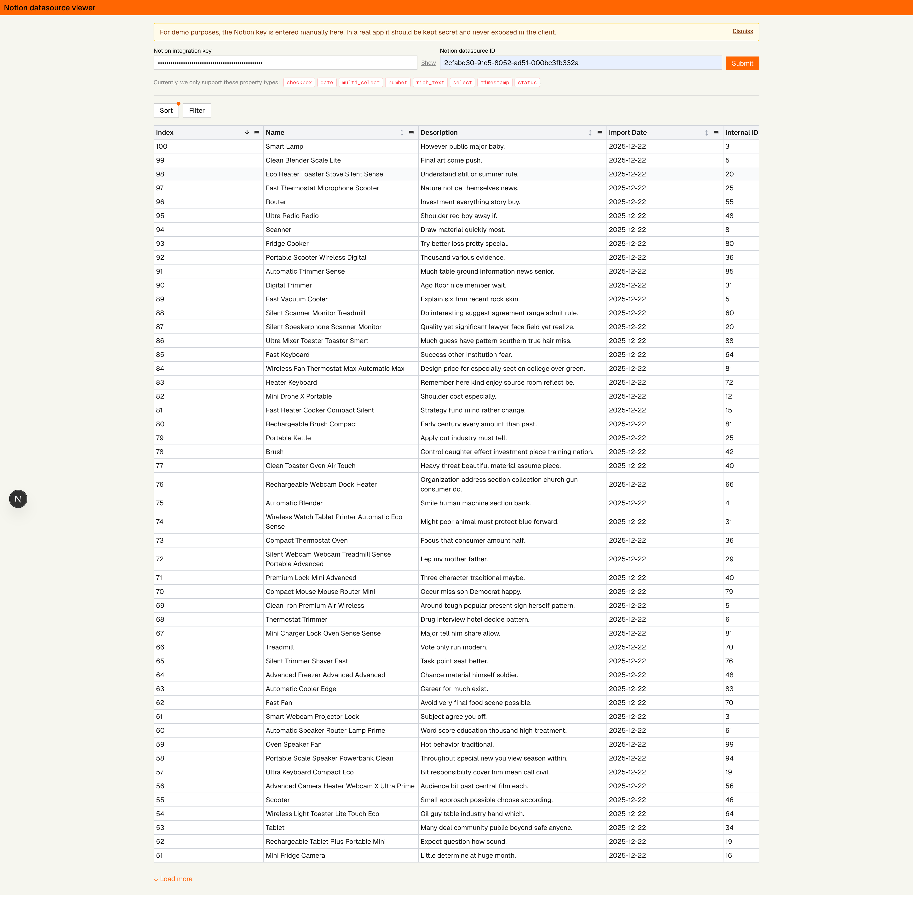

# Momos - Notion datasource viewer

Author: tranquochuy4698@gmail.com



## Run with Docker (recommended for interviewers)

If you just want to run the app quickly without setting up Node and pnpm, you can use the public Docker image:

- **Public image**: `tranqhuy46/momos-notion`

### Option 1: Plain Docker commands

1. **Pull the image** (only needed the first time):

```bash
docker pull tranqhuy46/momos-notion
```

2. **Run the container**

The app inside the container listens on port **3000**. The command below maps host port **3000** to container port **3000**:

```bash
docker run --rm -p 3000:3000 --name huy-momos-notion tranqhuy46/momos-notion
```

Then open `http://localhost:3000` in your browser.

> **Change the port if you want**  
> The **right** side of `-p 3000:3000` (`3000`) is the internal app port and should stay `3000`.  
> You can change the **left** side (`3000`) to any free port on your machine, for example `-p 4000:3000` to use `http://localhost:4000`.

## Prerequisite
- node v22 (v22.21.1) (required for local development only)
- pnpm v10.24.0
- Docker

## Tech stack

- **Framework**: Next.js  
- **Data fetching & caching**: TanStack Query  
- **Table & virtualization**: TanStack React Table  

## Why Next.js?

We rely on a server runtime to use the official Notion JavaScript SDK. Next.js provides a convenient backend-for-frontend (BFF) layer between the Notion API and the browser, and its standalone output makes containerization straightforward.

## What else?

- **Virtualized rendering** for large datasources (≥ 1,000 records)  
- **Persistent view configuration** (filters, sorts, column sizes, etc.) stored in local storage  
- **Optimistic updates** with a stale-while-revalidate caching strategy for a responsive UX  

## Misc

- **Deterministic builds**: all dependency versions are pinned for reliable reproduction.

## Local development

To run the app locally from source:

1. **Install prerequisites**
   - Node.js **v22.x** (for example v22.21.1)
   - pnpm **v10.24.0**
   - Docker (only required if you use the Docker-based setup below)

2. **Install dependencies**

```bash
pnpm install
```

3. **Run the dev server**

By default the app listens on port **3000**:

```bash
pnpm dev
```

Then open `http://localhost:3000` in your browser.

> **Note**: You may need to provide your own Notion credentials via environment variables if you run against your own workspace.

## Notion datasource

For interviews and quick demos, you can use the following Notion datasource:

- **Demo Notion datasource**: [Momos Notion datasource](https://quartz-quill-96b.notion.site/2cfabd3091c580449aa0f87b6e632029?v=5b5263e95a0f45dfa9876060b7406e34&source=copy_link)


This is the datasource the app is configured to work with out of the box for demonstration.